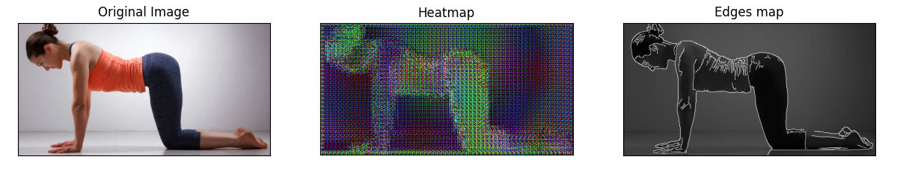

### Overview
+ `run.py`: borrow from https://github.com/csbanon/canny-edge-detector
+ `canny.py`: working with OpenCV
+ `Heatmap_Canny.py`: Both Canny Edges Estimation & Heatmap Extraction

### Results

### Description

**Canny Edge Estimation** is an implementation of the edge detection method defined by John Canny in 1986. This is done by performing the following computational steps:

1. Perform Gaussian smoothing on the image.
2. Compute the gradient magnitude and orientation using derivative masks.
3. Perform non-maximum suppression.
4. Perform hysteresis thresholding.

The input of this program is the file path to an image of your choice.

**Heatmap Estimation** is simply a lightweight Fully Convolutional Network (but the architectural is more like SegNet), including:
+ 3 Conv layers 
+ 3 deConv layers